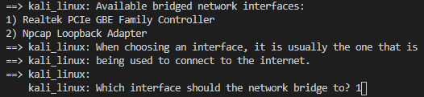

# Install Kali - Discord Helper

## Before you begin

Remember that Kali Linux is a professional security operating system, it comes pre-configured with numerous tools for conducting information security tasks such as pen-testing, security research, and reverse engineeering; Kali should **NOT** be used as your [primary/general-purpose operating system](https://www.kali.org/docs/introduction/should-i-use-kali-linux/). To further this, if you're unfamiliar with Linux, you should not use Kali in order to get familiar with it, instead use another distribution, for example Ubuntu. If you wish to read more about this, please read the Kali Linux documentation by Offensive Security.

## Installation

#### Prerequisites

Install [VirtualBox](https://www.virtualbox.org/wiki/Downloads) as this is the default provider to the upcoming software used in this repository. In doing so, you keep the installation process standardised an simpler to troubleshoot.

Afterwards, download [Vagrant](https://www.vagrantup.com/downloads) as this is the software which enables distribution of a virtual machine image that is already configured, making it the installation process repeatable.

Now, ensure you have [Git installed](https://git-scm.com/book/en/v2/Getting-Started-Installing-Git) on your computer, follow the relevant instructions for your current operating system. If you are unsure, then run the command `git --version` in your terminal/console window, if you see an error, this means you do not have it installed. 

#### Usage

Once you have everything installed, clone the repository to get the files and change the current directory to the folder which was just created.

    git clone https://github.com/jdockerty/install-kali
    cd install-kali

By default Vagrant uses VirtualBox as a provider to serve the virtual machine. By previously installing it, this makes the installation process much simpler. Now run the command

    vagrant up

This command will take some time, whilst the virtual machine is downloaded and loaded into virtual box for you. A timer will be displayed that estimates the remaining time to wait.

When prompted which network should be bridged to, select the network adapter which is the main one for your computer, do not select a "loopback adapter". An example of this is shown below

In this example, we select 1, as this is our main network interface card.

Once up, default credentials to the machine will be

    Username: vagrant
    Password: vagrant

This is displayed upon completion, but also serves as a reminder here. You may wish to create your own user, although this is out of the scope for this walkthrough.

If you wish to turn off the machine at any point, you can either do this from inside of the virtual machine itself or using the command `vagrant halt` on your home computer, this will gracefully shutdown the machine.

Vagrant will install the virtual machine with predefined hardware specifications, if you wish to alter these, then you can do so from the interface of the VirtualBox application.